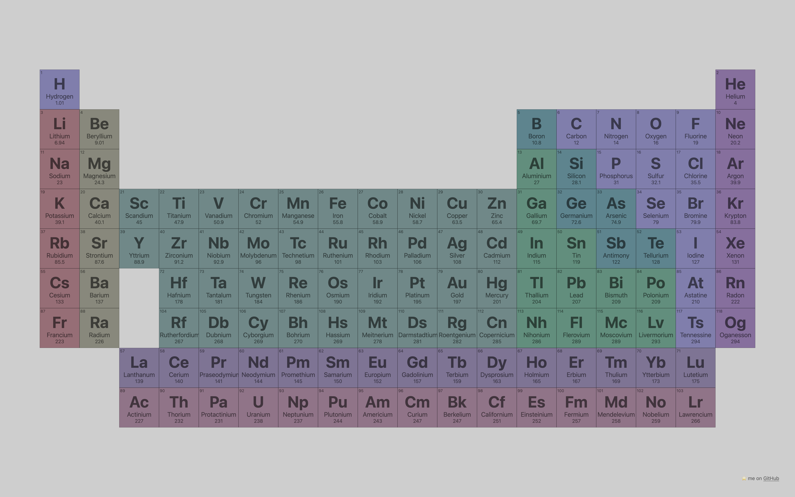
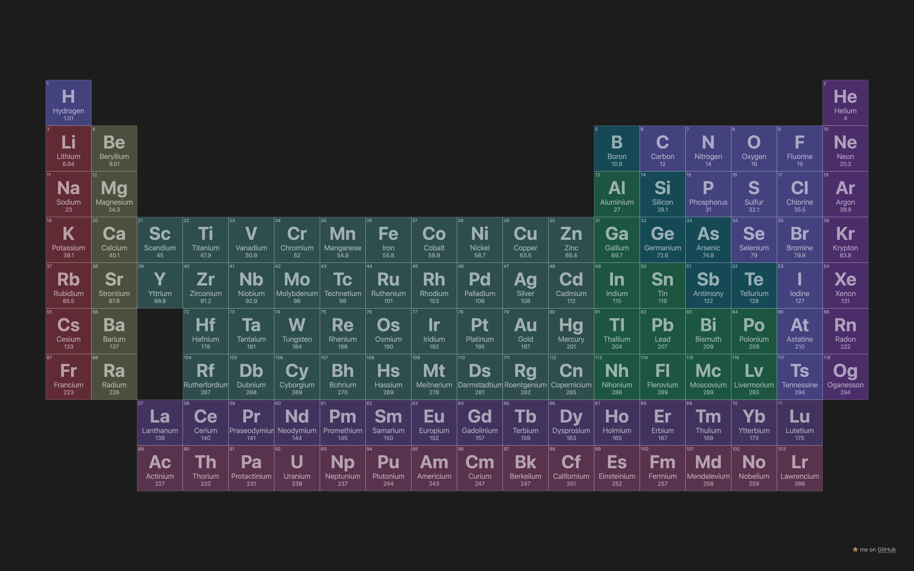

# ptable

This is an elegant periodic table site written using Svelte. It's super minimalist with no clutter or unwanted features, perfect as reference material while doing class assignments and stuff. If you like this project, please consider giving it a star! ⭐️

### Usage

You can access the public version of the site at [ptable.cyborg.cf](https://ptable.cyborg.cf). If you'd like to self-host it:

1. Clone the repository.
```
$ git clone git@github.com:sinistrecyborg/ptable.git
$ cd ptable
```
2. Install the dependencies and build the site.
```
$ yarn install
$ yarn build
```
3. The static site should be in the `public` folder.

If you want to make modifications to it (changing color schemes, etc) I would suggest using `yarn dev` to hot reload changes as you make them.

### Screenshots



### License
ptable is released under the [GNU GPL v3](./LICENSE) license.  
This project uses the [Svelte](https://svelte.dev/) framework, which is released under the [MIT License](https://github.com/sveltejs/svelte/blob/master/LICENSE.md).
